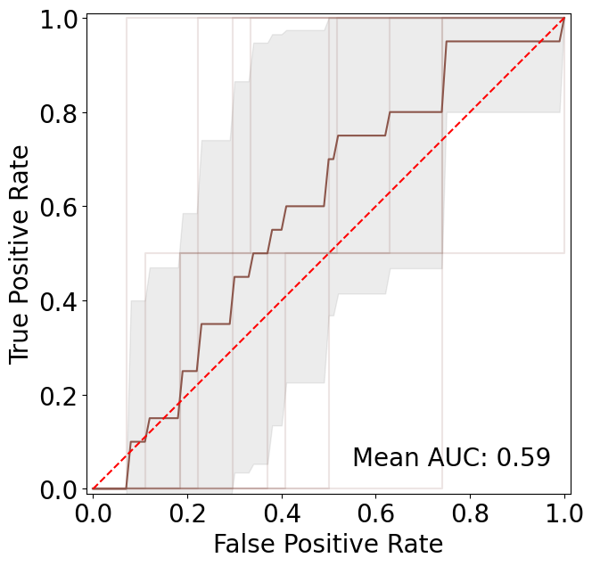
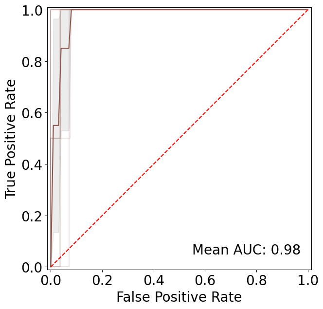

# Using Machine Learning to Predict the Antibacterial Activity of Ruthenium Complexes

 

## Abstract

Rising antimicrobial resistance (AMR) and lack of innovation in the antibiotic pipeline necessitate novel approaches to discovering new drugs. Metal complexes have proven to be promising antimicrobial compounds, but the number of studied compounds is still low. Lately, machine learning (ML) has emerged as a valuable tool for guiding the design of small organic molecules, potentially even in low-data scenarios. For the first time, we extend the application of ML to the discovery of metal-based medicines. Utilising 288 modularly synthesized ruthenium arene Schiff-base complexes and their antibacterial properties, a series of ML models were trained. The models perform well and are used to predict the activity of 54 new compounds. These displayed a 5.1x higher hit-rate (48.1%) against methicillin-resistant Staphylococcus aureus (MRSA) compared to the original library (9.4%), demonstrating that ML can be applied to improve the success-rates in the search of new metalloantibiotics. This work paves the way for more ambitious applications of ML in the field of metal-based drug discovery.

## Repository Structure 

The repository is structured as follows:

* **data**: Contains all building blocks used in the study. "Tested" building blocks were used to train the models, "library" building blocks were used to build a library of 76,906,368 complexes. 

* **data/libraries**: Contains the library of 76,906,368 complexes with the corresponding antibacterial activity predictions from the SVM and MLP models. Since these files are too large for GitHub, they need to be generated locally or downloaded from [here](https://doi.org/10.5281/zenodo.8413660). Mind that this directory is not present in the repository. 

* **models**: Contains all the trained models.

* **notebooks**: Following notebooks are found in the repository:

    * **01_Models**: Contains all the code to evaluate and train the models as well as generate the library of 76,906,368 complexes with the corresponding antibacterial activity predictions from all models.

    * **02_Analysis**: Contains all the code to analyse the building block usage of complexes with predicted antibacterial activity.

## Prerequisites

You will need following prerequisites to run the notebooks:

* [Python 3.7](https://www.python.org)
* [NumPy](https://numpy.org)
* [Pandas](https://pandas.pydata.org)
* [RDKit](https://www.rdkit.org)
* [scikit-learn](https://scikit-learn.org/stable/)
* [matplotlib](https://matplotlib.org)
* [seaborn](https://seaborn.pydata.org)
* [joblib](https://joblib.readthedocs.io/en/latest/)

## Models 

In the course of the project, six classical machine learning models were evaluated in a 10-fold cross validation. Random Forest (RF), Naïve Bayes (NB), Support Vector Machine (SVM), Multilayer Perceptron (MLP), Extreme Gradient Boosting (XGB) and k-Nearest Neighbours (kNN) models were implemented using scikit-learn. The notebook "01_Models" contains all the code to evaluate and train the models and generate the evaluation plots (shown below). 

<div>
    
    
</div>

Generated figures show the AUCs for the SVM model with scrambled labels (left) and true labels (right).

All trained models are stored in the "models" folder for later use, and can be easily loaded using the joblib library. Find an example on how to generate the fingerprints starting from the building blocks and predict their antibacterial activity using one of the provided models. 

### Running your own predictions

```python
from joblib import load
import numpy as np
from rdkit import Chem
from rdkit.Chem import AllChem, DataStructs

# Load building blocks as RDKit mol objects
amine = Chem.MolFromSmiles('NC1=CC=CC=C1')
aldehyde = Chem.MolFromSmiles('C(C1=CC=C2C(C=CC=C2)=N1)=O')
arene = Chem.MolFromSmiles('C1=CC=CC=C1')

# Generate fingerprints
amine_fp = np.array(AllChem.GetMorganFingerprintAsBitVect(amine, 2, nBits=512))
aldehyde_fp = np.array(AllChem.GetMorganFingerprintAsBitVect(aldehyde, 2, nBits=512))
arene_fp = np.array(AllChem.GetMorganFingerprintAsBitVect(arene, 2, nBits=512))

# Combine fingerprints
combined_fp = np.sum([amine_fp, aldehyde_fp, arene_fp], axis=0)

# Load model
model = load("models/svm.joblib")

# Predict antibacterial activity of the complex
model.predict(fingerprint.reshape(1, -1))
```
Mind that the original models were trained on a small set of organometallic complexes (288) and their applicability domain is limited to the chemical space presented in the manuscript. We therefore recommend to retrain the models before using them on your own data.

## License
[MIT](https://choosealicense.com/licenses/mit/)

## Contact

 


